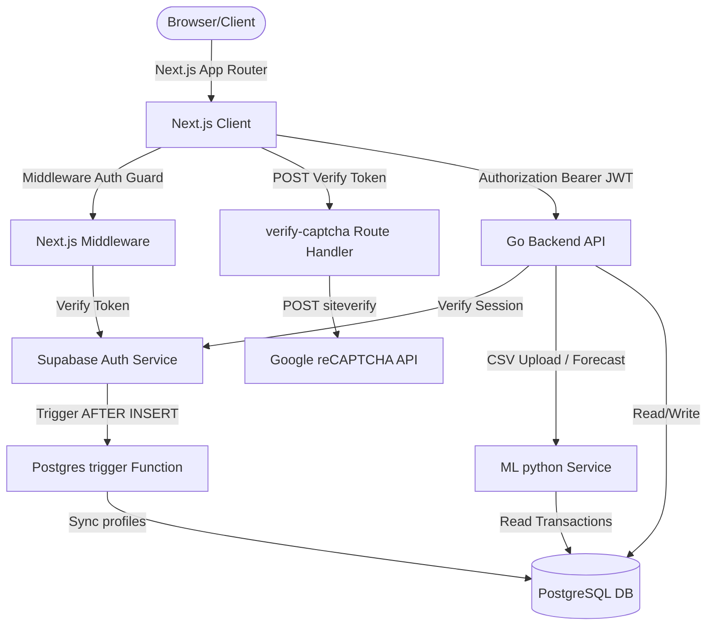
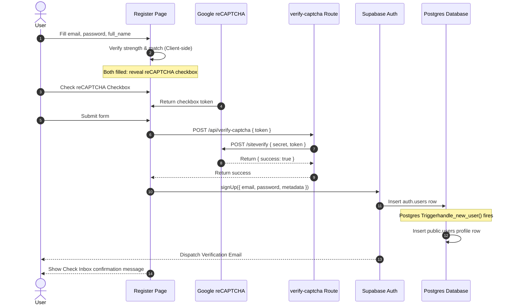
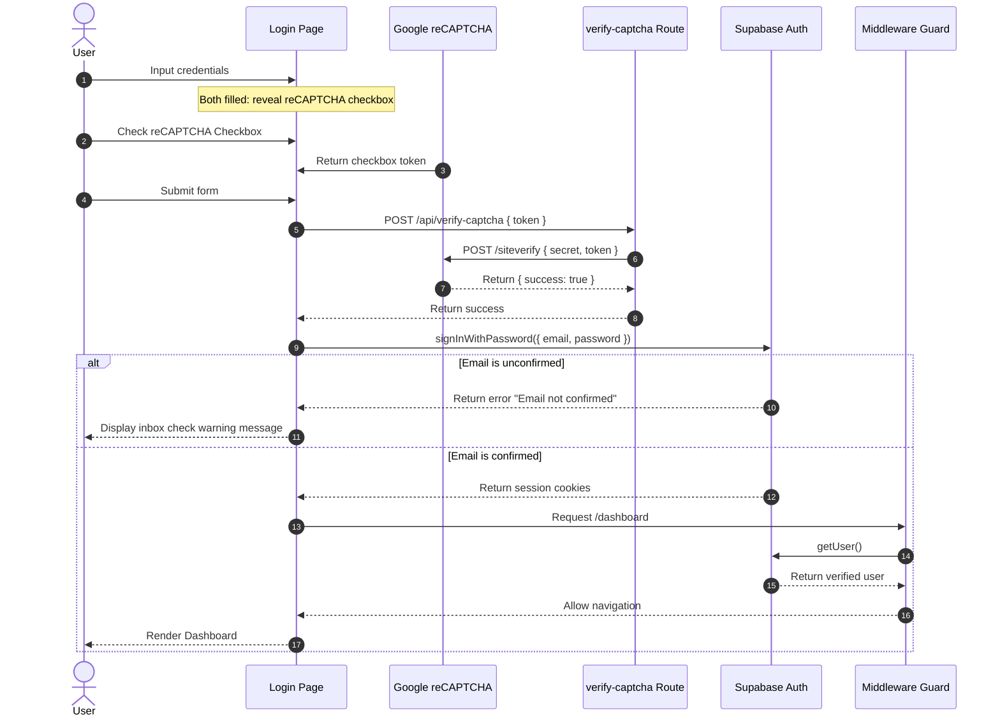
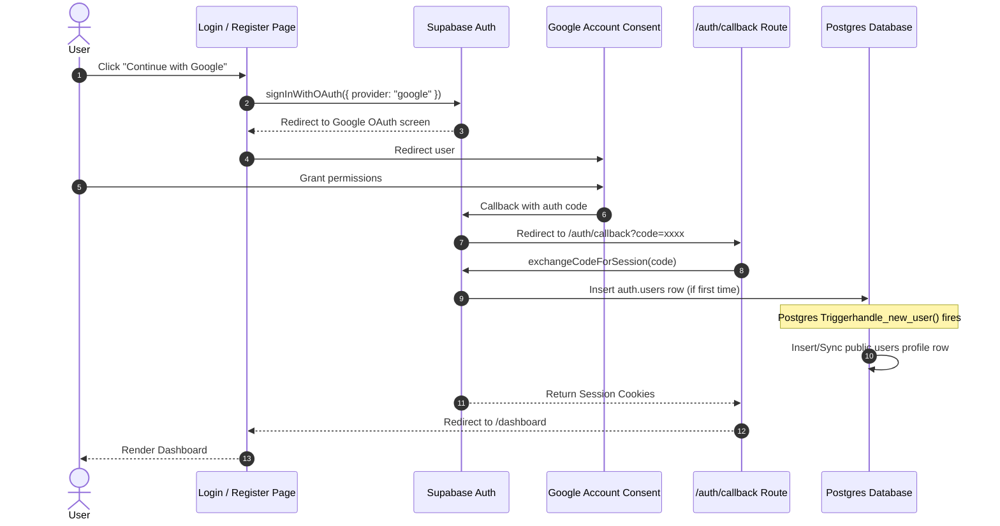

# FinFlow SaaS — End-to-End System Design Architecture

This document describes the complete architecture and data flow of FinFlow.

---

## 1. System Architecture

---

## 2. Authentication Flow journeys

### A. User Registration Journey

### B. User Login Journey

### C. Google OAuth Flow Journey

---

## 3. Core Components

1. **Next.js Frontend Client**: Written in TypeScript using React, Framer Motion for premium aesthetics, and Tailwind CSS.
2. **Next.js Middleware**: Handles route guards. Checks authorization headers and cookies. Redirects unauthenticated or unconfirmed users to the login screen.
3. **Go Backend API**: Core service exposing endpoints for ledger data, anomaly detection, Holt-Winters forecasting, and Lemon Squeezy billing. Uses Supabase session tokens to identify the authenticated caller.
4. **ML Python Service**: Machine learning microservice responsible for classification and cash flow forecasting using statsmodels.
5. **Supabase Auth**: Managed user database, session cookies, OAuth client flows, and confirmation dispatch.
